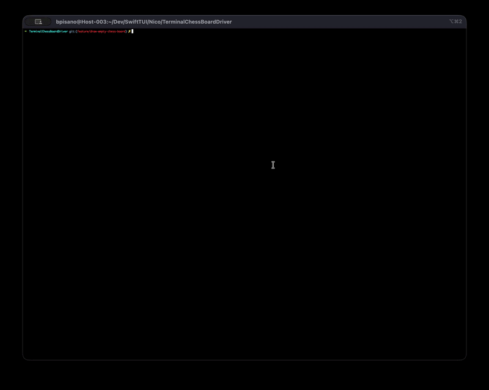

# SwiftTUI

A SwiftUI engine that renders to the terminal.


*Credits: Nicolas Dominati with its chess app created with SwiftTUI*

## Requirements

- macOS 26 or later
- Swift 6.3 toolchain or later

## Installation

Create a new executable target and add SwiftTUI as a dependency in your `Package.swift`:

```swift
let package = Package(
    name: "MyApp",
    platforms: [
        .macOS(.v26)
    ],
    dependencies: [
        .package(url: "https://github.com/bpisano/SwiftTUI", from: "0.0.3")
    ],
    targets: [
        .executableTarget(
            name: "MyApp",
            dependencies: ["SwiftTUI"]
        )
    ]
)
```

## Usage

The entry point is a type conforming to `App`, marked `@main`.

```swift
import SwiftTUI

@main
struct MyApp: App {
    var body: some View {
        Text("Hello, World!")
    }
}
```

Views nest, and `@State` holds values that change. Here a button updates a count:

```swift
import SwiftTUI

@main
struct MyApp: App {
    var body: some View {
        Counter()
    }
}

struct Counter: View {
    @State private var count = 0

    var body: some View {
        VStack(alignment: .leading) {
            Text("Count: \(count)")
            Button("Increment") {
                count += 1
            }
        }
    }
}
```

Run your app with `swift run`. SwiftTUI takes over the terminal, draws the view tree, and processes keyboard input. Press `Ctrl-C` to exit.

## Features

- **Views** — `Text`, `Button`, `TextField`, `ForEach`.
- **Layout** — `HStack`, `VStack`, `ZStack`, plus the `frame` and `padding` modifiers.
- **State and data flow** — `@State`, `@Binding`, `@Environment`.
- **Focus** — keyboard navigation between controls (Tab / Shift-Tab / arrows) and
  the `@Focus` property wrapper for moving focus programmatically.
- **Styling** — `Color`, `foregroundStyle`, `ShapeStyle`, and custom `ButtonStyle`.

Many SwiftUI APIs are not yet supported (for example `Spacer`, `Divider`, `background`/`overlay`, gradients, `Toggle`/`Slider`/`Picker`). See the [compatibility guide](https://bpisano.github.io/SwiftTUI/documentation/swifttuicore/swiftuicompatibility) for the current list.

## Documentation

You can read the full documentation [here](https://bpisano.github.io/SwiftTUI/documentation/swifttuicore).

Guides:

- [Getting Started](https://bpisano.github.io/SwiftTUI/documentation/swifttuicore/gettingstarted)
- [Laying Out Views](https://bpisano.github.io/SwiftTUI/documentation/swifttuicore/layingoutviews)
- [Controls](https://bpisano.github.io/SwiftTUI/documentation/swifttuicore/controls)
- [Managing Focus](https://bpisano.github.io/SwiftTUI/documentation/swifttuicore/managingfocus)
- [Styling Views](https://bpisano.github.io/SwiftTUI/documentation/swifttuicore/stylingviews)
- [SwiftUI Compatibility](https://bpisano.github.io/SwiftTUI/documentation/swifttuicore/swiftuicompatibility)

## Licence

SwiftTUI is licensed under the MIT License. See the [LICENSE](LICENSE) file for more information.
